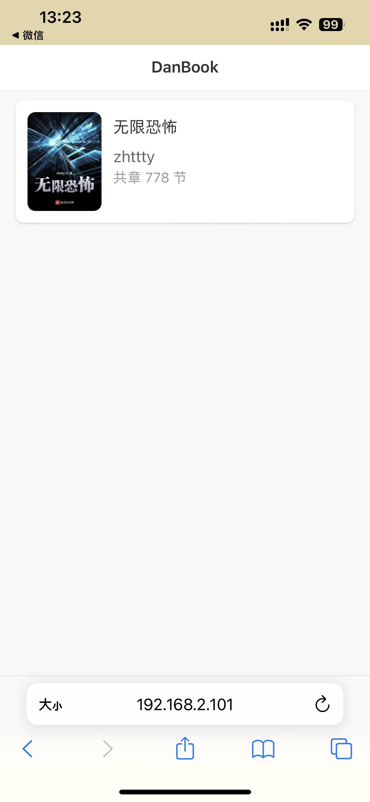
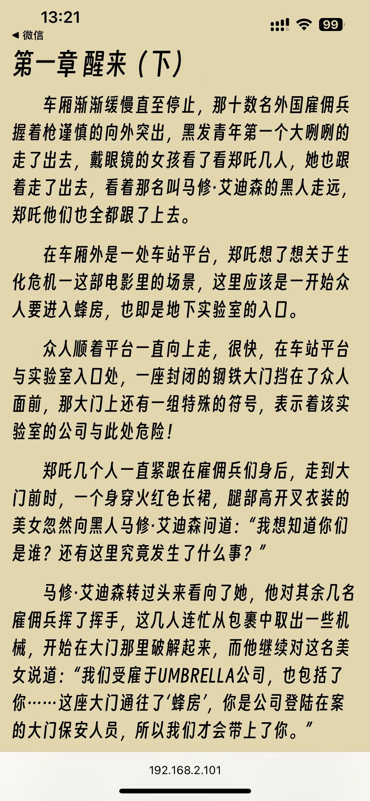
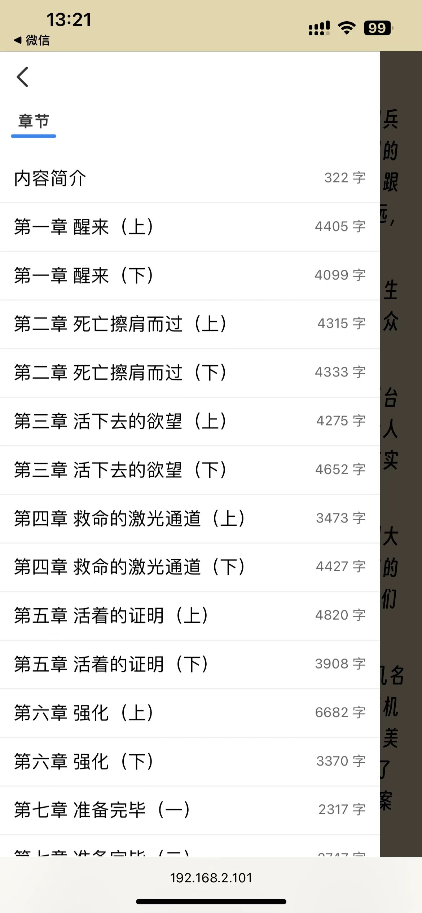

# 一个非常简单的阅读小玩意
起因是因为某些原因导致 iPhone 上阅读小说软件卸载了，现在软件下架安装不了....（此处省略一万字）  
总结：闲的  

## 技术栈
后端是 Node + sqlite3 （选这个是因为不用安装数据库环境,懒得）  
主要是 TXT 类型的小说自动分章节  
（👆 本人没啥后端思维写的贼拉，反正能跑就行  
哦，记得在 api 目录下新建一个 books 的目录，不然后端运行会报错  

前端是 vite + vue3 + pinia （balabala...

## 实现
- [x] 接口导入书籍自动分割章节
- [x] 首页列表
- [x] 章节列表\文章详情
- [x] 前台的记住阅读记录
- [ ] 阅读相关设置的自定义
- [ ] 自定义分章规则
- [ ] 其它想到了再说

也许再下次闲的时候继续完善(?) 随缘    

## 图片预览

